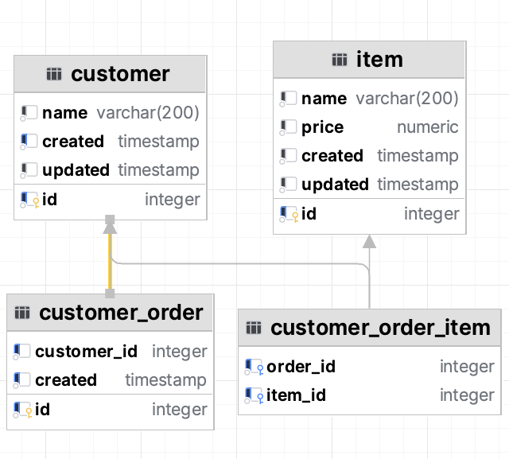

# database-optimisation-lab

This project consists of
1. A shell script to start a postgres in docker [start_postgres.sh](start_postgres.sh).
   User is 'postgres'
   Password is 'docker'
2. A migration using Flyway to set up a base DB - SetupTables
3. A generate data process to generate date - [GenerateData.scala](src/main/scala/com/pbyrne84/databaseoptimisationlab/datasetup/GenerateData.scala)
4. A DB dump so we can reset easily. Step 3 takes quite a while (20 minutes)
5. A set of example SQL statements a system like this can be expected to run. Inner join, left Join, subquery, distinct, group by and even a union.

No indexes have been added, this allows us to we can see how upset databases can get. They prefer certain approaches, and database
implementations (Oracle, MySQL, Postgres) can behave differently. They do not always pick the best path of execution and can 
sometimes need us to rewrite the queries in another form per database engine.

## Database design

The database represents a very common design.

* Customer table
* Customer Order table
* Item table
* Customer Order item

A customer can have many orders, many items can be per order. 
Customer and Item are the parent tables that we determine data integrity from. We should not be able to create an order
for a customer that does not exist, we should also not be able to add an item to an order if it does not exist.

As there are no indexes, it will perform incredibly poorly. Seq Scan on a Postgres explain plan means full table scan.
Usually you want to avoid those :)




### SQL Joins and temp tables

When we do some queries, the database will create a temporary table with some results in the background to do processing
from. These temporary tables can get very, very large depending on the query. For example, it may decide to do a cartesian
product which is every combination of Table A with every combination of Table b, so if each table has 1000 records, we end
up with a table of 1,000,000 records. 

Not a design that will scale with data increase and real time multi-user usage.


## Link to get a compressed db archive

https://www.dropbox.com/scl/fi/mjujqa9owah8ifru2spzk/db_backup.7z?rlkey=r5h7tsilbju187zxqzt0xvhe3&dl=0

## Importing db
```shell
psql -f .\db_backup -U  postgres
```

to 7zip pg_dump (more efficient)


```
brew install p7zip
brew update
7z a db_backup.7z db_backup
```


## Database index operations

### Adding a primary key to an existing table

```sql
ALTER TABLE customer ADD PRIMARY KEY (id);
```

### Adding an non-unique index to an existing table

This will by default create an ascending index, so order by desc may benefit an index going the other way

```sql
CREATE INDEX customer_created_idx ON customer
(
    created
)
```

### Add foreign key
Cannot have an order without a related customer

Worth noting
```
PostgreSQL does not automatically index foreign key columns, 
```
This can be quite common across databases, whereas MySQL will create an index automatically.
Indexes affect write speed but usually not enough to not have them.

```sql
ALTER TABLE customer_order
    ADD CONSTRAINT fk_order_customer FOREIGN KEY (customer_id) REFERENCES customer(id);
```

Now some may like the idea of putting triggers on foreign keys, so if we deleted a customer, it would not complain about it 
having child records but just delete them as well, not having said triggers have saved me from my clumsy hands a few times.
Personally, I prefer to manually delete the child records as it is child safe.


